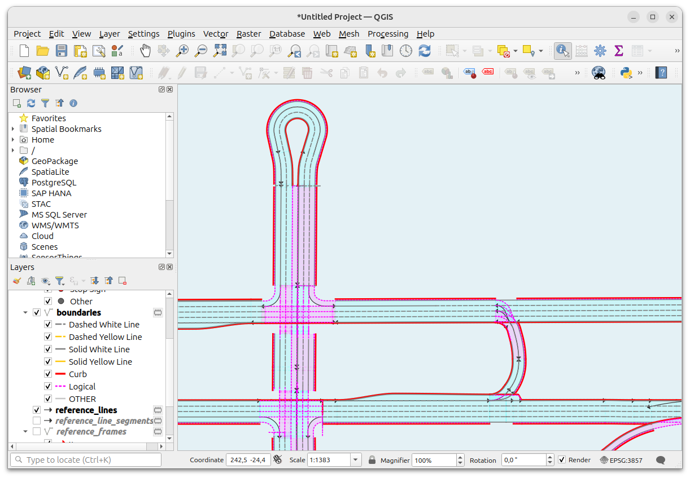

# OpenDRIVE Viewer QGIS Plugin

A QGIS plugin to visualize OpenDRIVE maps, written in Python.
It support visualization of OpenDRIVE road geometries.

## Installation

To run, extract the Python package to your QGIS Python plug-in directory.

For example, on Windows:
`C:\Users\<user>\AppData\Roaming\QGIS\QGIS3\profiles\default\python\plugins`

### Dependency Installation

This QGIS plugin requires `numpy`, `shapely`, and `scipy` to be installed in QGIS. If these dependencies are not installed, you will face error messages during startup.

To install these dependencies, you can either use the `qpip` plugin to install the dependencies automatically, or use `pip` of the QGIS installation.

For Windows:
`<QGIS_DIR>\python-qgis.bat -m pip install -r <HOME>\AppData\Roaming\QGIS\QGIS3\profiles\default\python\plugins\odrviewer\requirements.txt`

## Open a Map

Press `Vector` -> `OpenDRIVE Viewer` -> `Open...` to load an OpenDRIVE map into QGIS.

If the OpenDRIVE file provides a valid geo reference in the header, the map will be displayed at the correct location (lat/lon).
Some OpenDRIVE maps don't contain a valid geo reference header (e.g. the official sample files), and these maps will be places "somewhere".

## Additional Features

- The plugin creates some additional layers to visualize details of the reference line. This can be helpful when debugging visualization / geometry issues.

## Limitations

This plugin is in the early development stages. So far, there is no support for junctions, objects, signals or railroad.

## License

This plugin uses parts of https://github.com/driskai/pyxodr published under MIT license.
